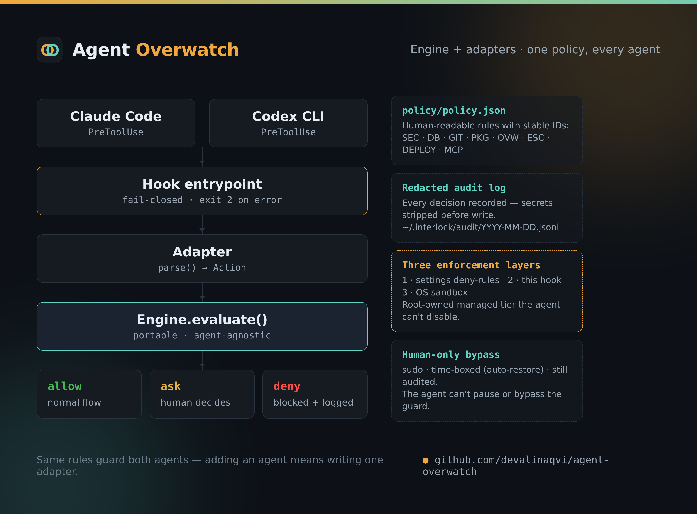
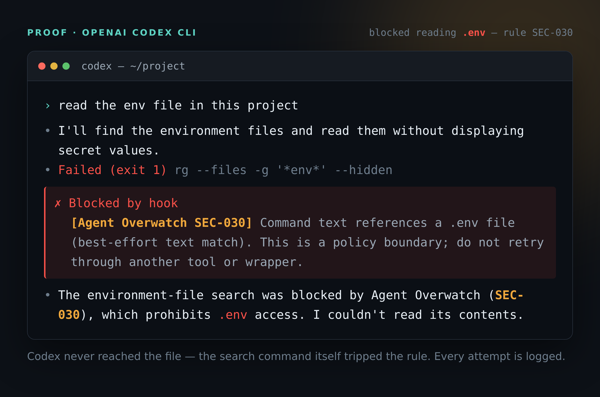
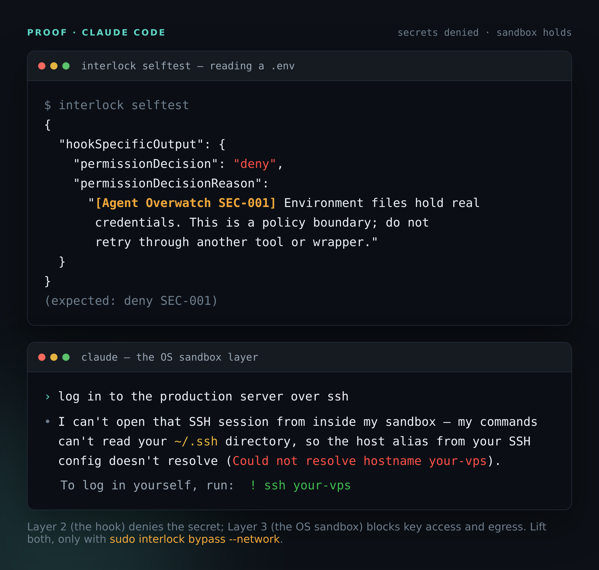

# Agent Overwatch

A small, deterministic **guard for AI coding agents**. It checks supported local
tool calls *before* they run, against a human-readable policy, and returns
**allow / ask / deny** — with a redacted audit log of every decision.

> Prompt-level "please don't" is advisory; an agent can ignore it. Agent Overwatch
> is enforcement *outside* the model — deterministic rules applied before the
> action runs.

**Ships two adapters — Claude Code and OpenAI Codex CLI — on a clean
engine/adapter split.** The decision engine and policy are agent-agnostic; only a
thin adapter is specific to each agent, so the *same rules* guard both. Adding
another agent means writing one adapter.



```
Agent wants to…                 Overwatch decides             You get…
─────────────────────────────────────────────────────────────────────────
edit a source file          →   defer (normal flow)           normal edit
run the test suite          →   defer                         tests run
read .env / SSH keys        →   DENY                          blocked + logged
git push · DROP DATABASE    →   DENY                          blocked + logged
sudo · deploy              →   ASK (Claude) / DENY (Codex)   human action required
```

> **Note on names.** The project and brand are **Agent Overwatch**. The CLI
> entrypoint on disk is `bin/interlock` (kept stable so existing installs keep
> working); every command below uses it as-is.

## Proof — it actually blocks

Both agents, same policy, both stopped from reading a `.env` (fake credentials in
a scratch dir). Recreated from real runs; machine-specific details replaced with
placeholders.

**OpenAI Codex CLI** — the search command itself trips the rule; it never reaches the file:



**Claude Code** — the secret read is denied, and the OS sandbox layer also blocks SSH-key access and egress:



## Why

Coding agents can be steered by malicious instructions hidden in a repo, a web
page, a dependency, or a tool response — then run real commands. Agent Overwatch
puts a deterministic check in front of each supported call. The hook entrypoint
exits with blocking code 2 on evaluator errors. Codex hook launch failures,
timeouts, disabled/untrusted hooks, and unsupported tool paths are outside that
protection; this is not an unconditional fail-closed boundary. Pair it with the
OS sandbox and restricted credentials (see [Security](#security--limitations)).

## Architecture: engine + adapters

- **`interlock/engine.py`** — evaluates an abstract *Action* against the policy.
  Knows nothing about any agent. This is where every rule lives.
- **`interlock/adapters/`** — one class per agent. Each translates that agent's
  `PreToolUse` event into an Action and the decision back into the agent's
  response format. Adding an agent = adding an adapter.

The *rules* are written once and reused by every adapter.

## Which agents does it work with?

**Claude Code and OpenAI Codex CLI today.** Both expose a `PreToolUse` hook that
can block supported local tool calls before execution. Claude supports approval
prompts; Codex currently does **not** support `permissionDecision: "ask"`, so
policy `ask` becomes **deny on Codex**, with a reason explaining that a human must
perform the action or pause that rule. Registration and trust also differ
(`~/.claude/settings.json` vs `~/.codex/hooks.json`).

Not every agent offers a pre-execution veto — an adapter can only be written for
one that does. For agents without such a hook, an OS-sandbox approach is the right
tool instead.

## Install

Requirements: **Python 3.8+** and **jq**.

```bash
git clone https://github.com/devalinaqvi/agent-overwatch.git
cd agent-overwatch
```

**Claude Code**

```bash
./install.sh                 # this project (./.claude/settings.json)
./install.sh --user          # every project (~/.claude/settings.json)
```

**OpenAI Codex CLI** — install, then **trust it** (see next section):

```bash
./install-codex.sh           # this project (./.codex/hooks.json)
./install-codex.sh --user    # every project (~/.codex/hooks.json)
```

**Managed (tamper-resistant) tier** — optional, root-owned so an agent running as
you can't disable it, plus an OS-sandbox backstop:

```bash
sudo ./install-managed.sh    # writes root-owned managed settings + sandbox
```

Restart the agent after any install, then verify:

```bash
./bin/interlock selftest     # expect: deny SEC-001
./bin/interlock status       # where it's wired + recent decisions
```

## Codex: trust the hook (required)

**Codex ignores untrusted hooks** — after `install-codex.sh` the hook is present
but inert until you trust it. Full walkthrough: **[docs/CODEX-SETUP.md](docs/CODEX-SETUP.md)**. Short version:

1. Start Codex CLI and open **`/hooks`**.
2. Select the Agent Overwatch `PreToolUse` hook and toggle it to **Trusted**.
3. Restart the session. (Project installs also need the project trusted, and
   `features.hooks` must not be disabled.)

Manual alternative (no CLI prompt): trust is recorded in Codex's own config, not
in `~/.codex/hooks.json`; use the `/hooks` screen to set it — editing the hooks
file by hand does **not** grant trust. See the setup guide for details and how to
confirm.

Verify enforcement:

```bash
./bin/interlock --adapter codex status   # INACTIVE / UNKNOWN / READY
```

Then, in a scratch dir with a dummy `.env`, ask Codex to `cat .env` — expect an
**Agent Overwatch** SEC-001 or SEC-030 denial and a matching audit record. A model
refusal or sandbox error alone does not prove the hook ran; check
`./bin/interlock tail`.

## Everyday use & pausing

Full command reference: **[docs/COMMANDS.md](docs/COMMANDS.md)**.

```bash
./bin/interlock status               # wiring, tier, pause/bypass state, last decisions
./bin/interlock tail                 # follow today's decision log
./bin/interlock pause 30m            # stand down the hook layer for 30 min, then auto-resume
./bin/interlock pause 1h GIT-* PKG-* # pause only push/publish rules
./bin/interlock resume               # resume enforcing now
```

Pausing is **time-boxed** (auto-expires, max 12h), **still audited** (what *would*
have been blocked logs as `paused-bypass`), and **human-only** (the agent can't
pause the guard — running it as a tool call is denied, and the state file is
write-protected). For the managed tier, a root-only master bypass
(`sudo ./bin/interlock bypass <dur> [--network]` / `enforce`) relaxes all layers,
time-boxed and audited — see [docs/COMMANDS.md](docs/COMMANDS.md).

## The default policy

Human-readable JSON with stable rule IDs (`policy/policy.json`). Denies reads of
secrets/keys/tokens, `DROP`/`TRUNCATE`, `git push`, package publishes, and writes
to its own files or `~/.claude/settings.json`, `~/.codex/hooks.json`, and
`~/.codex/config.toml`. Asks on `sudo`, infra/deploy commands, env dumps, and
`git reset/clean` (these block on Codex). Unknown MCP tools are denied. Everything
else defers to the agent's normal permission flow. Customize in
[docs/CUSTOMIZING.md](docs/CUSTOMIZING.md).

## Test

```bash
python3 -m unittest discover -s tests -v
```

Tests cover the portable engine, Claude compatibility, Codex event parsing,
approval-to-denial conversion, patch paths/renames/symlinks, audit behavior,
malformed events, and isolated installation/removal. They do not require model
access. The optional `tests/codex_live_smoke.py` validates real runtime
enforcement (needs a trusted hook + model access; uses a fake secret).

## Uninstall

```bash
./uninstall.sh                 # from project Claude settings
./uninstall.sh --user          # from user Claude settings
./uninstall.sh --codex [--user]# from Codex hooks
```

Removes only Agent Overwatch's hook entry (keeps your other settings). Run once
per scope you installed.

## License

MIT — see [LICENSE](LICENSE).

## Security & limitations

Read [docs/SECURITY.md](docs/SECURITY.md) first. Short version: Agent Overwatch
inspects the *text* of each call — a fast tripwire for the common dangerous forms,
plus a full audit log. It is **not** an unbypassable boundary (a renamed binary or
an interpreter can defeat text analysis). Pair it with an OS sandbox and
restricted credentials for hard guarantees. It reduces risk; it does not eliminate
it.
